# Model Comparison Table

This comparison was generated using the custom prompt file [model-compare.prompt.md](../.github/prompts/model-compare.prompt.md) and using `Claude Opus 4.6`. You can generate your own using `/model-compare` in the Copilot Chat.

> [!NOTE]
> As the model world is moving quickly, the information in this predefined document might be outdated. Use the `/model-compare` command as described above to get a file with the latest information.

---

## 1. ⚖️ Balance Between Performance and Cost

Good all-rounders for common development tasks. Versatile, cost-effective, suitable as daily drivers.

**Pros:** 🔄 Versatile · 💸 Cost-effective · 🌐 Multilingual · ✍️ Documentation · 🔧 Code review

| Model | Use Case / Differentiator | GA/Preview | Special Abilities | Multiplier (Paid) | Multiplier (Free) |
| --- | --- | --- | --- | --- | --- |
| GPT-4.1 | Default for common dev, broad knowledge | ✅ | 👓 Visual, 🌐 Multilingual | 0 (included) | 1 |
| GPT-5 mini | Reliable default for coding & writing across languages | ✅ | 👓 Visual | 0 (included) | 1 |
| GPT-4o | Lightweight dev, conversational, visual input | ✅ | 👓 Visual, 🌐 Multilingual | 0 (included) | 1 |
| Claude Sonnet 4.5 | General-purpose coding and agent tasks | ✅ | - | 1 | N/A |
| Claude Sonnet 4.6 | Improved completions, smarter reasoning, agent tasks | ✅ | 👓 Visual | 1 | N/A |
| GPT-5.3-Codex | Higher-quality code on complex engineering tasks | ✅ | 🤖 Agentic | 1 | N/A |
| Grok Code Fast 1 | 🚀 Fast coding & debugging across languages | ✅ | - | 0.25 💸 | 1 |
| Qwen2.5 | Code generation, reasoning, and code repair | ✅ | - | TBD | N/A |
| Raptor mini | 🚀 Fast inline suggestions and explanations | 🚧 | - | 0 (included) | 1 |

---

## 2. 🚀 Fast, Low-Cost Support for Basic Tasks

Optimized for speed and responsiveness. Ideal for quick edits, utility functions, syntax help, and lightweight prototyping.

**Pros:** 🚀 Speed · ⚡ Low latency · 💸 Low cost · 🔁 Repetitive tasks · 📝 Quick feedback

| Model | Use Case / Differentiator | GA/Preview | Special Abilities | Multiplier (Paid) | Multiplier (Free) |
| --- | --- | --- | --- | --- | --- |
| Claude Haiku 4.5 | 🚀 Fast responses, lightweight coding questions | ✅ | - | 0.33 💸 | 1 |
| Gemini 3 Flash | 🚀 Fast, reliable lightweight coding answers | ✅ | - | 0.33 💸 | N/A |
| GPT-5.1-Codex-Mini | 🚀 Fast reasoning and debugging at low cost | 🚧 | - | 0.33 💸 | N/A |
| GPT-5.4 mini | 🚀 Codebase exploration, grep-style tool specialist | 🚧 | 🤖 Agentic | 0.33 💸 | N/A |

---

## 3. 🧠 Deep Reasoning & Multimodal Inputs

Designed for step-by-step reasoning, complex decision-making, multi-file understanding, and visual analysis. Best for architecture, debugging, and agentic workflows.

**Pros:** 🧠 Deep reasoning · 🔍 Multi-file analysis · 🏗️ Architecture · 🐛 Debugging · 👓 Visual

| Model | Use Case / Differentiator | GA/Preview | Special Abilities | Multiplier (Paid) | Multiplier (Free) |
| --- | --- | --- | --- | --- | --- |
| Claude Sonnet 4.0 | Balanced performance & practicality for coding | ✅ | - | 1 | N/A |
| Gemini 2.5 Pro | Complex code generation, debugging, research | ✅ | 👓 Visual | 1 | N/A |
| Gemini 3 Pro | Advanced reasoning, long-context analysis | ✅ | 👓 Visual | 1 | N/A |
| Gemini 3.1 Pro | Effective edit-then-test loops, high tool precision | 🚧 | 🤖 Agentic | 1 | N/A |
| GPT-5.1 | Multi-step problem solving, architecture analysis | ✅ | - | 1 | N/A |
| GPT-5.1-Codex | Multi-step problem solving, architecture analysis | 🚧 | 🤖 Agentic | 1 | N/A |
| GPT-5.1-Codex-Max | Agentic software development at scale | ✅ | 🤖 Agentic | 1 | N/A |
| GPT-5.2 | Multi-step problem solving, architecture analysis | ✅ | - | 1 | N/A |
| GPT-5.2-Codex | Agentic software development | ✅ | 🤖 Agentic | 1 | N/A |
| GPT-5.4 | 🧠 Complex reasoning, code analysis, decisions | ✅ | - | 1 | N/A |
| Claude Opus 4.5 | 🧠 Complex problem-solving, sophisticated reasoning | ✅ | - | 3 💰 | N/A |
| Claude Opus 4.6 | 🧠 Most powerful Anthropic model, deep reasoning | ✅ | - | 3 💰 | N/A |
| Claude Opus 4.6 (fast mode) | 🧠⚡ Fast complex reasoning (speed tradeoff) | 🚧 | - | 30 💰💰💰 | N/A |
| Goldeneye | 🧠 Complex problem-solving, sophisticated reasoning | 🚧 | - | N/A | 1 |

---

## References

- [AI model comparison](https://docs.github.com/en/copilot/using-github-copilot/ai-models/choosing-the-right-ai-model-for-your-task)
- [Requests in GitHub Copilot (Premium requests & multipliers)](https://docs.github.com/en/enterprise-cloud@latest/copilot/managing-copilot/monitoring-usage-and-entitlements/about-premium-requests?versionId=enterprise-cloud%40latest)

> **Legend:** ✅ = GA · 🚧 = Preview · 👓 = Visual/multimodal support · 🤖 = Agentic capabilities · 💸 = Budget-friendly · 💰 = Expensive · 🚀 = Fast · 🧠 = Deep reasoning

---

## Model Summary Overview: Performance vs. Quality & Cost

```mermaid
graph LR
    %% Fast / Low-Cost
    subgraph "🚀 Performance (Faster · Lower Cost)"
      ch45["Claude Haiku 4.5<br/>0.33x 💸"]
      g3f["Gemini 3 Flash<br/>0.33x 💸"]
      g51cm["GPT-5.1-Codex-Mini<br/>0.33x 💸 🚧"]
      g54m["GPT-5.4 mini<br/>0.33x 💸 🚧"]
      ch45 --> g3f
      g3f --> g51cm
      g51cm --> g54m
    end

    %% Balanced / General-Purpose
    subgraph "⚖️ Balanced (Cost-Effective · Versatile)"
      grok["Grok Code Fast 1<br/>0.25x 💸"]
      g41["GPT-4.1<br/>0x (included)"]
      g5m["GPT-5 mini<br/>0x (included) 👓"]
      g4o["GPT-4o<br/>0x (included) 👓"]
      cs46["Claude Sonnet 4.6<br/>1x 👓"]
      g53c["GPT-5.3-Codex<br/>1x 🤖"]
      grok --> g41
      g41 --> g5m
      g5m --> g4o
      g4o --> cs46
      cs46 --> g53c
    end

    %% Deep Reasoning / High Quality
    subgraph "🧠 Quality & Cost (Deeper · Higher Cost)"
      cs40["Claude Sonnet 4.0<br/>1x"]
      g25p["Gemini 2.5 Pro<br/>1x 👓"]
      g3p["Gemini 3 Pro<br/>1x 👓"]
      g54["GPT-5.4<br/>1x"]
      co45["Claude Opus 4.5<br/>3x 💰"]
      co46["Claude Opus 4.6<br/>3x 💰"]
      co46f["Claude Opus 4.6<br/>(fast mode)<br/>30x 💰💰💰 🚧"]
      cs40 --> g25p
      g25p --> g3p
      g3p --> g54
      g54 --> co45
      co45 --> co46
      co46 --> co46f
    end

    %% Connections between categories
    g54m -.-> grok
    g53c -.-> cs40

    %% Styling
    style ch45 fill:#a8e6cf,stroke:#333,stroke-width:2px,color:#000
    style g3f fill:#a8e6cf,stroke:#333,stroke-width:2px,color:#000
    style g51cm fill:#a8e6cf,stroke:#333,stroke-width:2px,color:#000
    style g54m fill:#a8e6cf,stroke:#333,stroke-width:2px,color:#000
    style grok fill:#88d8f7,stroke:#333,stroke-width:2px,color:#000
    style g41 fill:#88d8f7,stroke:#333,stroke-width:2px,color:#000
    style g5m fill:#88d8f7,stroke:#333,stroke-width:2px,color:#000
    style g4o fill:#88d8f7,stroke:#333,stroke-width:2px,color:#000
    style cs46 fill:#88d8f7,stroke:#333,stroke-width:2px,color:#000
    style g53c fill:#88d8f7,stroke:#333,stroke-width:2px,color:#000
    style cs40 fill:#f7c59f,stroke:#333,stroke-width:2px,color:#000
    style g25p fill:#f7c59f,stroke:#333,stroke-width:2px,color:#000
    style g3p fill:#f7c59f,stroke:#333,stroke-width:2px,color:#000
    style g54 fill:#f7c59f,stroke:#333,stroke-width:2px,color:#000
    style co45 fill:#f4a4a4,stroke:#333,stroke-width:2px,color:#000
    style co46 fill:#f4a4a4,stroke:#333,stroke-width:2px,color:#000
    style co46f fill:#f4a4a4,stroke:#333,stroke-width:2px,color:#000
```

